# 🛠 Active Directory & Entra ID Hybrid Lab in Azure (Windows Server 2025)


---

## 🎯 Project Overview

This project is a hands-on enterprise identity environment built in Microsoft Azure. It simulates a real-world IT setup starting with on-prem Active Directory on Windows Server 2025 and extending into Microsoft Entra ID using a modern hybrid identity and Zero Trust access model.

The environment is designed to reflect realistic enterprise behaviour rather than simplified lab assumptions. It covers identity lifecycle management, device trust, Conditional Access, and Microsoft enforced MFA, with validation and troubleshooting carried out at each stage.

This project demonstrates practical IT support, desktop support, and junior systems administration skills in a hybrid cloud environment.

---

## 🧠 Skills Demonstrated

- Windows Server 2025 administration
- Active Directory Domain Services
- DNS configuration and troubleshooting
- Organisational Units, users, and security groups
- Group Policy design and enforcement
- NTFS file permissions and access control
- Windows 11 domain joined client management
- Microsoft Entra ID hybrid identity
- Entra Connect Sync with OU filtering
- Hybrid Azure AD Join and device trust
- Conditional Access and Zero Trust principles
- Multi-Factor Authentication enforcement
- Legacy authentication blocking
- Identity and sign-in troubleshooting
- Azure virtual machine administration

---

## 🏗 Architecture Overview

The environment consists of:
- Azure Virtual Network hosting all resources
- Windows Server 2025 Domain Controller
- Windows 11 domain joined client
- Microsoft Entra ID tenant
- Entra Connect Sync bridging on-prem AD and Entra ID
- Conditional Access enforcing access controls at the cloud layer

This mirrors a common small to mid-sized enterprise hybrid identity architecture.

---

## 📚 Project Phases

### Phase 1 – Azure Infrastructure Setup
Provisioned Azure resources and deployed Windows Server 2025 as a virtual machine. Networking, inbound rules, and base VM configuration were completed to support domain services.

### Phase 2 – Domain Controller Deployment
Installed Active Directory Domain Services and promoted the server to a Domain Controller. Created the `lab.local` forest and configured DNS for reliable authentication.

### Phase 3 – Active Directory Structure
Built a realistic organisational structure using OUs, users, and security groups. Validated domain authentication using domain credentials.

### Phase 4 – Group Policy Implementation
Designed and applied Group Policy Objects to enforce security baselines including password policies, account lockout rules, and user restrictions. Policies were tested and verified.

### Phase 5 – Client Machine Domain Join
Deployed a Windows 11 client and joined it to the domain. Verified policy application, authentication, and trust from the client perspective.

### Phase 6 – File Shares and Permissions
Configured NTFS file shares with role-based access control. Tested permissions using different user accounts to validate least privilege access.

### Phase 7 – Security Hardening and Administration
Applied administrative best practices including access separation, system hardening, and realistic support level configurations. Focused on common troubleshooting scenarios.

### Phase 8 – Entra ID Hybrid Identity and Conditional Access
Extended the on-prem Active Directory into Microsoft Entra ID using Entra Connect Sync. Hybrid joined devices, enforced Conditional Access policies, required MFA, blocked legacy authentication, and configured an emergency break-glass account. Validated Zero Trust behaviour through testing.

---

## 🔧 Troubleshooting and Lessons Learned

- Hybrid joined devices use cloud identity for Single Sign-On by design
- Microsoft enforced MFA applies even when Conditional Access policies are set to report-only
- Device trust can be enforced without Intune compliance
- Conditional Access is often the root cause of unexpected sign-in behaviour
- `dsregcmd /status` is critical for validating hybrid join health

---
## ✅ Project Outcome

This project demonstrates the full lifecycle of building, securing, and validating a modern hybrid identity environment. It reflects current Microsoft security standards and real enterprise behaviour, making it suitable as a portfolio project for IT support, service desk, and junior systems administration roles.

---

# ☁️ Azure Infrastructure Setup

## 1️⃣ Resource Group  
- **Name:** `AD-Lab-RG`  
- **Region:** West Europe  


---

## 2️⃣ Virtual Network  
- **VNet:** `AD-Lab-VNet`  
- **Subnet:** `default`  
- **Address Space:** `10.0.0.0/16`
- **Subnet Space:** `10.0.0.0/24`

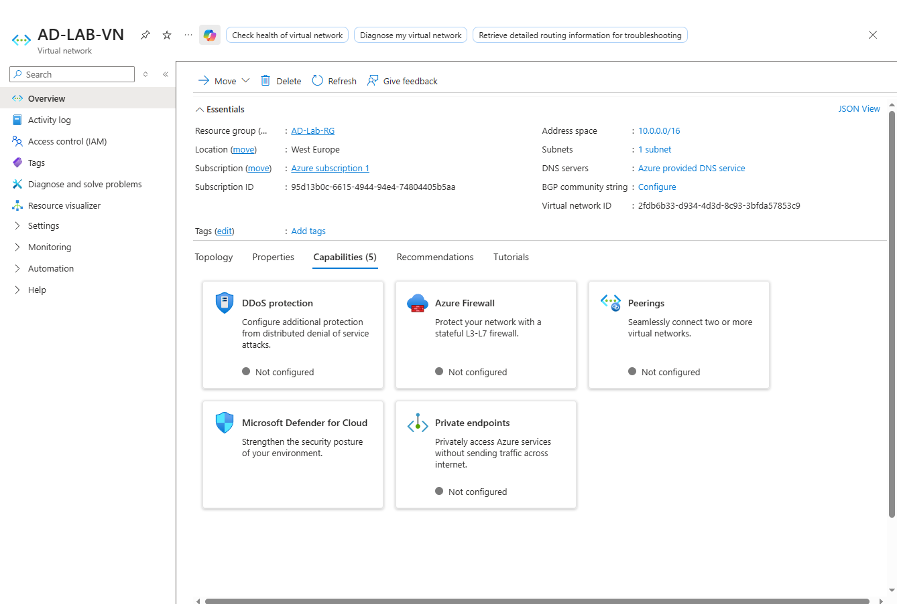

---

## 3️⃣ Windows Server 2025 Virtual Machine  
- **VM Name:** `AD-Lab-VM`  
- **Size:** `B2ls_v2`  
- **OS:** Windows Server 2025 Datacenter  
- **Inbound Ports:** RDP (3389)


---

## 4️⃣ Network Interface + Static IP  
- Enabled static private IP to support domain controller functions  
- Ensures DNS and authentication stability  

**NIC settings:**


**Static Private IP:**


---

# 🛠 Active Directory Domain Setup

## 1️⃣ Installed AD DS Role  
Using Server Manager → Add Roles and Features → Active Directory Domain Services

---

## 2️⃣ Promoted to Domain Controller  
Created a new forest:

- **Domain:** `lab.local`  
- DNS configured automatically  
- Server rebooted after installation  

**Domain Controller Confirmation:**


---

## 3️⃣ Logged in Using Domain Credentials  
Signed in as:
labadmin@LAB.LOCAL

---

# 🧠 Skills Demonstrated So Far

### 🔹 Azure Skills
- Deploying virtual machines  
- Network Interface configuration  
- Static IP assignment  
- Managing VNets and subnets  
- RDP connectivity troubleshooting  

### 🔹 Windows Server Skills
- Installing server roles  
- Managing Server Manager  
- Understanding domain controllers  
- DNS configuration  

### 🔹 Active Directory Skills
- Creating a new forest and domain  
- Promoting a server to Domain Controller  
- Logging in with domain credentials  
- Understanding domain structure  

This already demonstrates Tier 1 and Tier 2 support capabilities.

---

# 📸 Screenshots

| Description | Image |
|------------|--------|
| Azure Resource Group |  |
| Azure VM Overview |  |
| Network Interface |  |
| Static Private IP Configuration |  |
| Domain Controller Confirmation |  |

# 📌 Phase 2 — Active Directory Foundation Completed 

Phase 2 establishes the core Active Directory environment inside `lab.local`.  
This includes departments, users, admin accounts, service accounts, onboarding accounts, RDP permissions, and domain-level security policies.

---

## 🗂️ Organizational Units (OUs) Created

A clean, enterprise-style OU structure was created:

- **_Admins**
- **_Users**
- **_Groups**
- **_Computers**
- **_Departments**
  - IT
  - HR
  - Finance
  - Sales
  - Operations

📸 *OU Structure:*  


---

## 👥 Standard User Accounts (10 Users)

10 realistic employee accounts were added into `_Users`, then moved into their respective department OUs.

| Name | Username | Department |
|------|----------|------------|
| Adam Reid | areid | IT |
| Daniel Grant | dgrant | IT |
| Sarah Khan | skhan | HR |
| Laura Ibrahim | librahim | HR |
| Michael Brown | mbrown | Finance |
| Martin Stone | mstone | Finance |
| Emma Patel | epatel | Sales |
| Aisha Rahman | arahman | Sales |
| Jason Lee | jlee | Operations |
| Chloe Adams | cadams | Operations |

All users were created with:
- No forced password change at logon  
- Password never expires: **disabled**  
- Accounts enabled  

📸 *Users in Department OUs:*  


---

## 🔐 Privileged & Special Accounts

### 🛠️ IT Admin (Domain Administrator)
- Username: `itadmin`
- Added to:
  - Domain Admins  
  - Enterprise Admins  
  - Schema Admins  
- Password never expires: enabled

📸 *IT Admin Group Membership:*  


---

### ⚙️ Service Account (SQL Service)
- Username: `sqlsvc`
- Password never expires: enabled  
- User cannot change password: enabled  

📸 *Service Account Settings:*  


---

### 🚫 Onboarding Account
- Username: `new.starter`
- Account disabled  
- Simulates HR pre-staging

📸 *Disabled Account:*  


---

### 🔒 Locked-Out User (Help Desk Simulation)
- Username: `locktest`
- Locked via incorrect login attempts  
- Unlocked through ADUC (Account tab)

📸 *Locked-Out Account:*  


---

## 🔐 RDP & User Logon Rights Configuration

To allow non-admin users (like `locktest`) to use RDP:

### ✔ Added to Remote Desktop Users  
- `locktest` added to the **Remote Desktop Users** local group  

### ✔ Updated Local Security Policy  
- Confirmed Remote Desktop Users has RDP logon rights  

---

## 🔄 Account Lockout Policy (Domain Security)

Configured via **Default Domain Policy**:

- Lockout threshold: 5 attempts  
- Lockout duration: 15 minutes  
- Reset counter after: 15 minutes  

Successfully tested with `locktest`.

---

# 📌 Phase 3 — Department File Shares and NTFS Security (Completed)

Phase 3 introduces enterprise-style file sharing and NTFS permission design.  
Each department receives a secure folder and access is granted strictly through AD security groups.  
This demonstrates help desk and junior sysadmin skills including least privilege access control and permissions troubleshooting.

---

## 🗂️ Department Shares Created

A shared root directory was created on the Domain Controller.

C drive folder location:
    C:\Shares

Folder structure:
    C:\Shares
        IT
        HR
        Finance
        Sales
        Operations

📸 Folder structure  


---

## 👥 Active Directory Security Groups Created

Each department received a dedicated security group used for access control:

- IT_Staff_Members  
- HR_Staff_Members  
- Finance_Staff_Members  
- Sales_Staff_Members  
- Operations_Staff_Members  

📸 Group list  
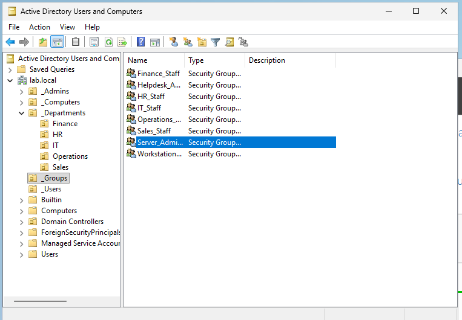

📸 IT group membership example  
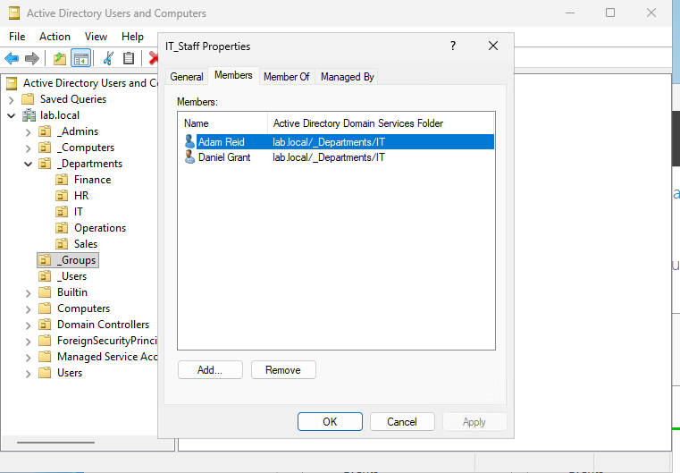

---

## 🔐 NTFS Permission Configuration

Key NTFS rules applied:
- Removed Authenticated Users  
- Granted Modify permissions to the correct department group  
- Domain Admins and SYSTEM keep Full Control  
- NTFS permissions control access rather than share permissions  
- Implements RBAC (Role Based Access Control)

---

## 📁 NTFS Permissions Per Department

### IT  


### HR  


### Finance  


### Sales  


### Operations  


---

# 📌 Phase 3.5 — Access Testing and Verification (Completed)

A real user (areid from IT) logged in to test permissions.

Expected behaviour:
- IT user can access IT folder  
- IT user cannot access HR, Finance, Sales or Operations  

---

## 🧪 Access Test Results (User: areid)

| Folder | Expected | Result |
|--------|----------|--------|
| IT | Allowed | ✔ Confirmed |
| HR | Denied | ✔ Confirmed |


📸 IT user accessing IT folder  


📸 IT user denied from HR folder  


---

# 🎉 Phase 3 and 3.5 Completed

This phase established:

- A clean enterprise style shared folder system  
- NTFS least privilege security  
- AD group based RBAC  
- Removal of inherited permissions  
- Department access isolation  
- Real world permissions troubleshooting  
- Hands on testing using standard domain accounts  

These are core skills used daily in IT Support, Service Desk and Junior Sysadmin roles.

---
# ⭐ Phase 4. Group Policy Configuration

This phase introduces organisation wide security controls and user experience settings using Group Policy on the domain controller AD-Lab-VM. Policies include password requirements, lockout rules, login banners, mapped drives and user restrictions.

---

# 👉 Step 0. Open Group Policy Management

On AD-Lab-VM:

- Start  
- Type gpmc.msc  
- Open Group Policy Management  

All GPOs in this phase are created and linked here.

---

# ⭐ 4.1 Domain Security Policy  
**GPO Name:** ORG-SecurityPolicy  
**Linked To:** lab.local

Configured:

- Minimum password length set to 8  
- Password complexity enabled  
- Maximum password age set to 90 days  
- Minimum password age set to 1 day  
- Password history set to 5 remembered  
- Account lockout threshold set to 5 attempts  
- Lockout duration set to 15 minutes  
- Reset counter after 15 minutes  

### Screenshots  
  


---

# ⭐ 4.2 Login Banner  
**GPO Name:** ORG-LoginBanner  
**Linked To:** lab.local

Displays a login warning message to all domain users.

Configured:

- Message title: Authorised Access Only  
- Message text: This system is for authorised use only. Activity may be monitored and recorded.  

### Screenshot  


---

# ⭐ 4.3 Block USB Storage  
**GPO Name:** ORG-DisableUSB  
**Linked To:** _Users OU

USB storage devices are restricted for standard users.

Configured under System → Removable Disks:

- Deny execute access  
- Deny read access  
- Deny write access  

### Screenshot  


---

# ⭐ 4.4 Department Drive Mapping  
Mapped drives are assigned per department.  
Only IT mapping is shown as an example.

**UNC Paths:**  
Root: \\AD-Lab-VM\Shares\

| Department | Drive Letter | Path |
|-----------|--------------|------------------------------|
| IT        | I:           | \\AD-Lab-VM\Shares\IT        |
| HR        | H:           | \\AD-Lab-VM\Shares\HR        |
| Finance   | F:           | \\AD-Lab-VM\Shares\Finance   |
| Sales     | S:           | \\AD-Lab-VM\Shares\Sales     |
| Operations| O:           | \\AD-Lab-VM\Shares\Operations|

### Screenshot (IT)


---

# ⭐ 4.5 Corporate Wallpaper  
**GPO Name:** ORG-Wallppaper  
**Linked To:** _Users OU

Wallpaper stored in:

```
\\AD-Lab-VM\NETLOGON\wallpaper.jpg
```

Applied using Desktop Wallpaper policy set to Fill.

### Screenshot  


---

# ⭐ 4.6 Disable Control Panel  
**GPO Name:** ORG-DisableControlPanel  
**Linked To:** _Users OU

Prevents standard users from opening Control Panel or PC Settings.

### Screenshot  


---

# ⭐ 4.7 Apply All GPOs

On AD-Lab-VM:

```
gpupdate /force
```

### Screenshot  


---

# ⭐ 4.8 Testing (Performed on Windows 11 VM)

Testing completed while logged in as the IT user: lab\areid

Verified:

- I drive successfully mapped  
- Corporate wallpaper applied  
- Control Panel blocked  

### Screenshots  
  
  


---

# Phase Outcome

Phase 4 successfully implemented organisation wide Group Policy settings including password policies, login warnings, USB restrictions, mapped drives, wallpapers and user restrictions. These controls standardise configuration and improve security across the lab environment.


---
# ⭐ Phase 5 — Windows 11 Client Deployment Using Tailscale (Completed)

Phase 5 connects a remote Windows 11 VM to the Azure hosted Domain Controller using Tailscale, simulating a real corporate remote worker environment.  
This allows secure delivery of DNS, LDAP, Kerberos and GPOs over an encrypted mesh network.

---

# ⭐ 5.1 Tailscale Network Setup

Tailscale was installed on:

- AD-Lab-VM (Domain Controller)  
- Host PC (DESKTOP-ASOA97E)  
- Windows 11 Client VM  

Each device received a private Tailscale IP:

| Machine | Tailscale IP |
|---------|--------------|
| AD-Lab-VM | `100.85.64.63` |
| Host PC | `100.89.252.38` |
| Windows 11 VM | `100.x.x.x` |

This created a secure mesh network allowing the Windows 11 VM to communicate with the Domain Controller even though they are in different locations.

### 📸 Required Screenshot  
- Tailscale running on AD-Lab-VM  
  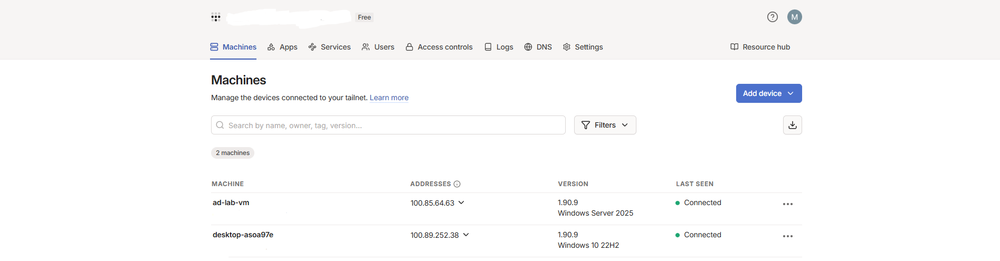

---

# ⭐ 5.2 DNS Configuration on Windows 11 VM

Active Directory requires clients to use the Domain Controller for DNS.

DNS was set as:

- Preferred DNS: `100.85.64.63`  
- Alternate DNS: `8.8.8.8` (optional)

This forces all Active Directory queries through the Domain Controller.

### 📸 Required Screenshot  
- Windows 11 DNS settings  
  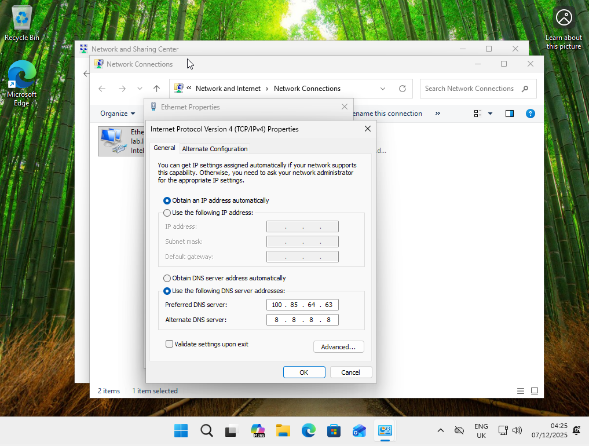

---

# ⭐ 5.3 Connectivity Checks

Before joining the domain:

nslookup lab.local


DNS successfully resolved the domain through the Domain Controller’s Tailscale IP.

(ICMP ping blocking is normal in Azure environments.)

### 📸 Required Screenshot  
- Successful nslookup  
 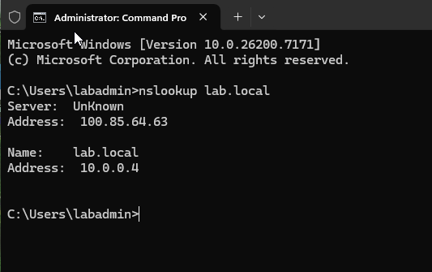

---

# ⭐ 5.4 Joining the Windows 11 VM to lab.local

The VM was joined to the domain using:

lab.local
lab\itadmin

After reboot, the domain relationship was established.

---

# ⭐ 5.5 Domain Login and GPO Application

Logged in using the IT user:
lab\areid


The initial login took longer due to:

- New profile creation  
- GPOs applying over Tailscale  
- SYSVOL and NETLOGON access over encrypted tunnel  

Once logged in, these GPOs were confirmed working:

- Corporate wallpaper  
- Drive mappings  
- Control Panel restriction  
- Login banner  

### 📸 Required Screenshots  
- Wallpaper applied  
  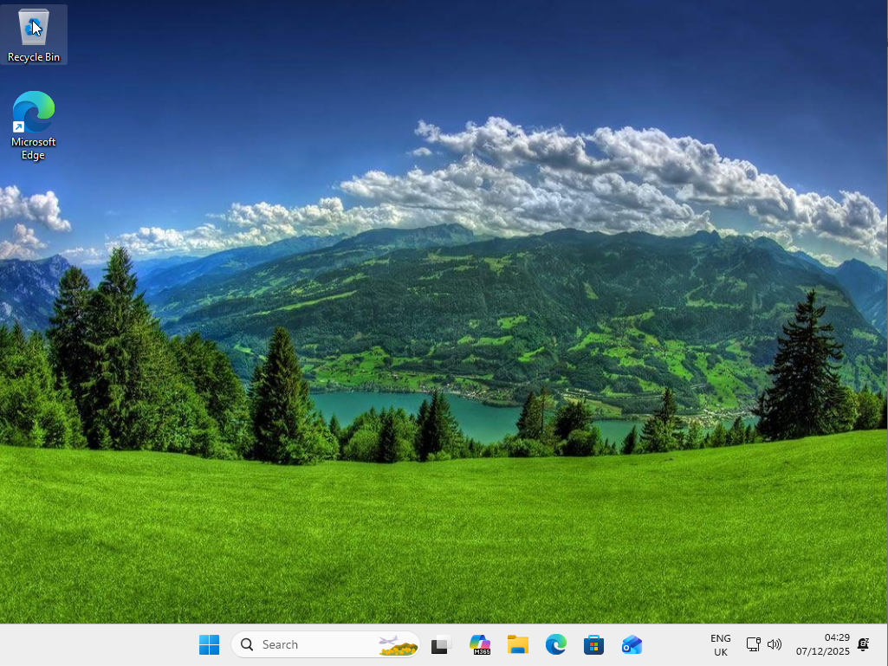  
- Drive mapping visible  
  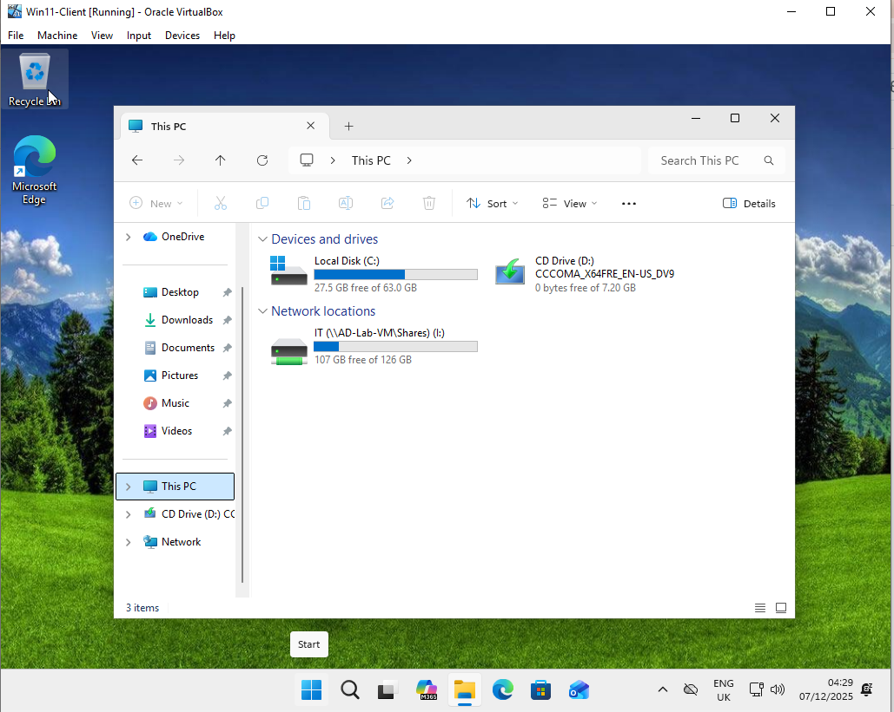  
- Control Panel blocked  
  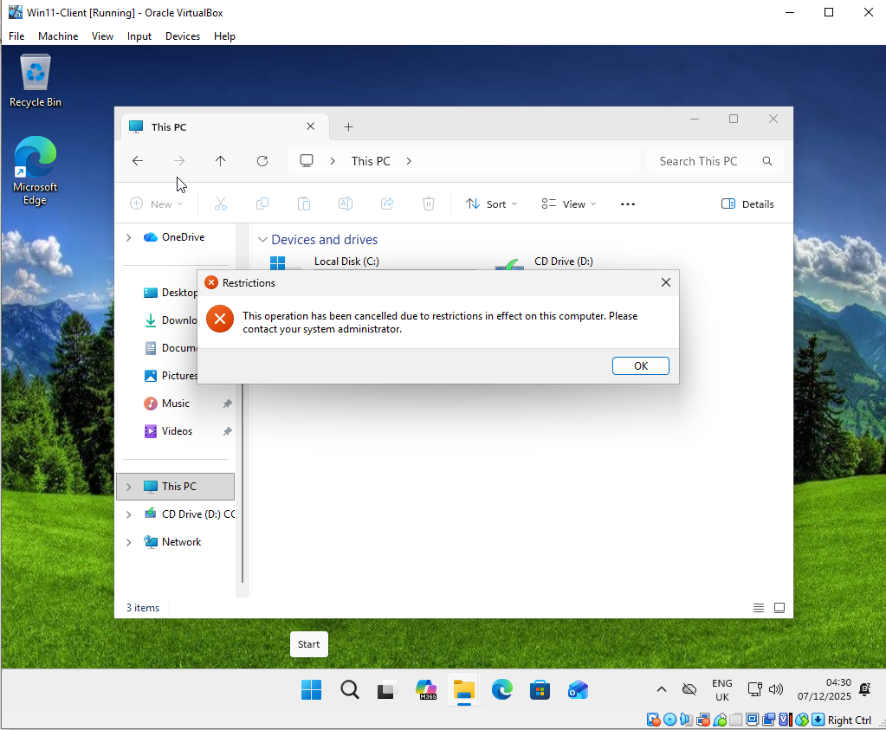

---

# ⭐ 5.6 Confirmation in Active Directory

The Windows 11 VM appeared under the **_Computers** container in ADUC, confirming a successful join and trust relationship.

### 📸 Required Screenshot  
- Computer object in ADUC  
  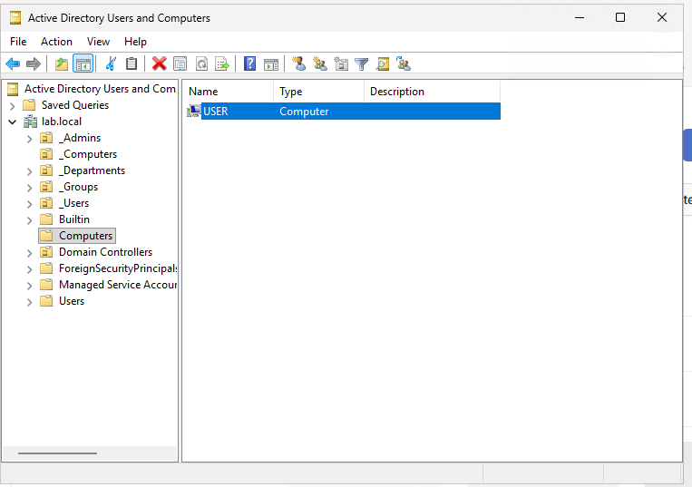

---

# 🎉 Phase 5 Completed

This phase demonstrated:

- Secure remote AD communication using mesh VPN  
- Remote domain join capability  
- DNS redirection for Active Directory  
- Delivery of GPOs over encrypted WAN  
- SYSVOL access and GPO enforcement through Tailscale  
- Realistic simulation of remote employee onboarding  

This is advanced enterprise level AD and networking knowledge typically used by IT Support, Systems Engineers and Cloud Administrators.

---
# ⭐ Phase 6 — Helpdesk Ticket Simulation (Real IT Support Scenarios)

This phase simulates real Service Desk and IT Support tasks that occur daily inside organisations.  
Each scenario demonstrates troubleshooting skills across Active Directory, permissions, Group Policy, and user lifecycle management.

The following six scenarios were completed:

1. Password Reset  
2. Account Unlock  
3. Department Change (Permissions + Drive Mapping)  
4. New Starter Onboarding  
5. Offboarding User  

All scenarios were performed using the Windows Server 2025 Domain Controller and the Windows 11 client machine.

---

# ✅ Scenario 1: Password Reset (User Forgot Password)

### 📝 Ticket  
“Hi IT, I cannot log into my account, I think I forgot my password.”

### 🛠 Resolution  
- Reset password in ADUC  
- User logged in successfully using new password

### 📸 Screenshots  
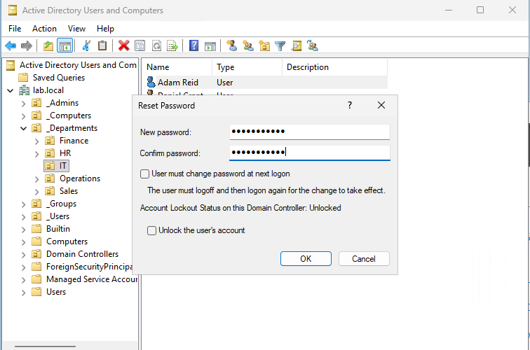  
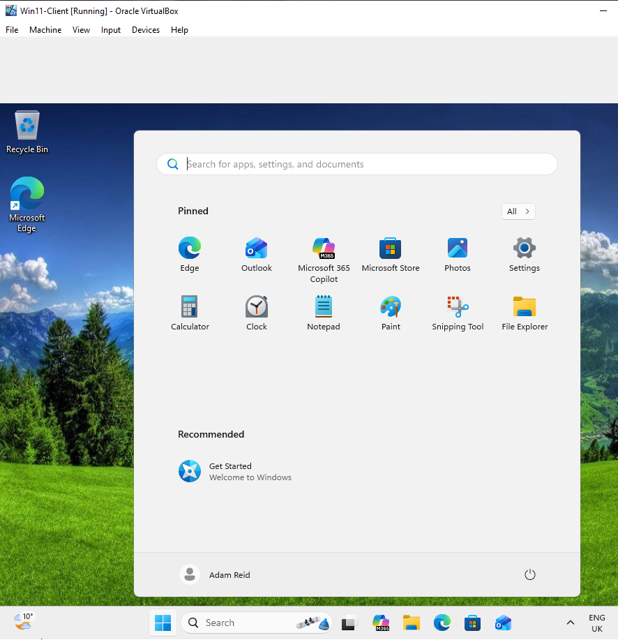

---

# ✅ Scenario 2: Account Locked Out

### 📝 Ticket  
“I typed my password wrong too many times and my account is locked.”

### 🛠 Resolution  
- Unlocked the account using ADUC → Account tab  
- User logged in successfully afterwards

### 📸 Screenshots  
  
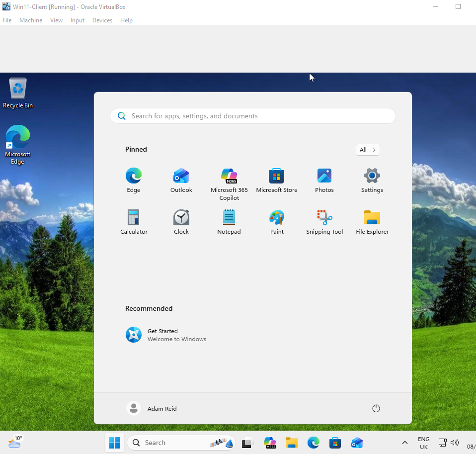

---

# ✅ Scenario 3: Department Change (Permissions + Drive Mapping Fix)

### 📝 Ticket  
“Emma Patel has moved from Sales to Finance. She needs Finance access and her Finance drive is not appearing.”

### 🛠 Resolution Steps  
- Removed user from **Sales_Staff**  
- Added to **Finance_Staff**  
- Moved user to **_Departments → Finance**  
- Updated Finance Drive Mapping GPO:  
  - UNC Path: `\\AD-Lab-VM\Shares\Finance`  
  - Drive Letter: F:  
  - Correct Item-level targeting: **Finance_Staff**  
- Restarted client and applied policies using gpupdate  
- Finance folder accessible, Sales folder denied  

### 📸 Screenshots  
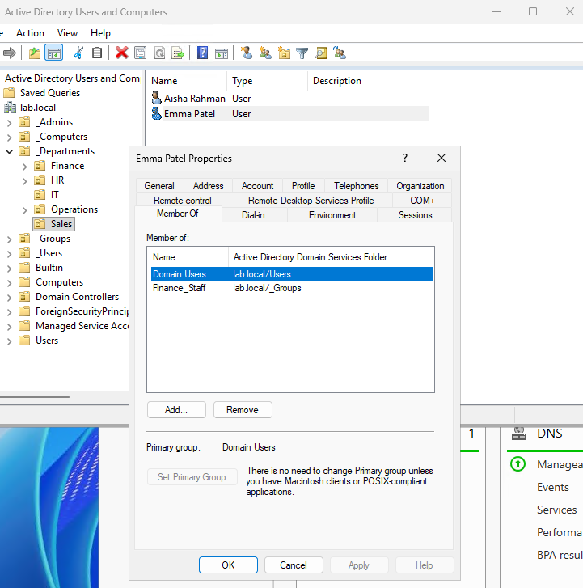  
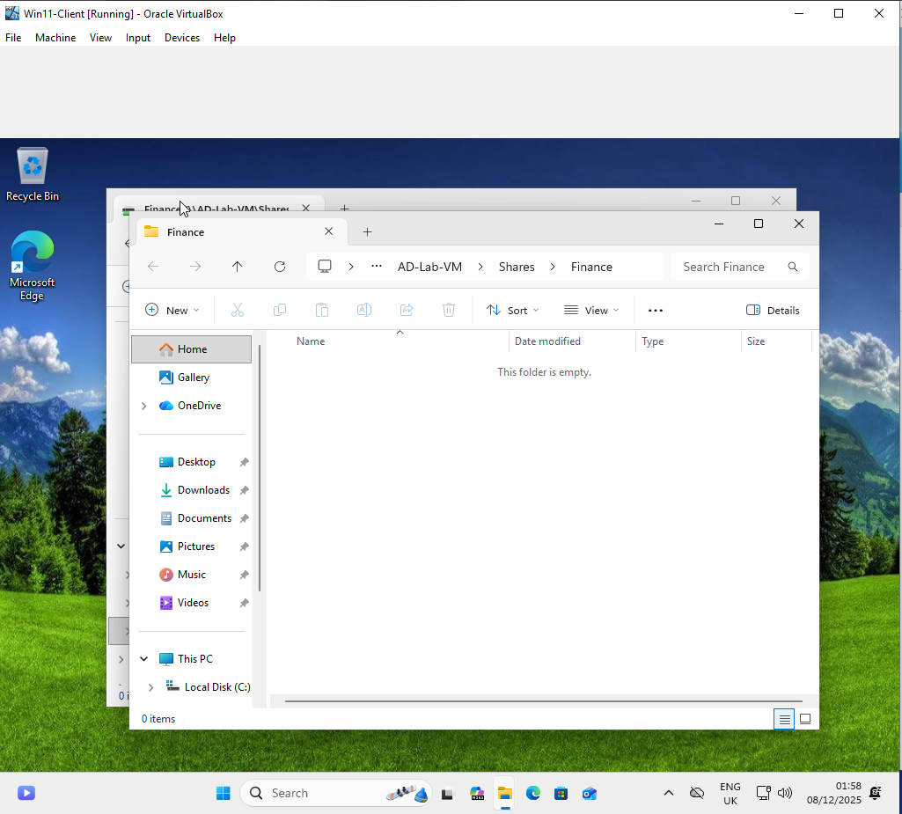  


---

# ✅ Scenario 4: New Starter Onboarding (Using Onboarding Template)

A disabled onboarding template account already existed:
new.starter


This is copied to create new employees.

### 📝 Ticket  
“Please create an account for new HR employee Aaliyah Clarke.”

### 🛠 Resolution Steps  
- Copied **new.starter** template  
- Created **aclarke**  
- Moved to **_Departments → HR**  
- Added to **HR_Staff**  
- Verified correct permissions  
  - HR folder allowed  
  - Other departments denied

### 📸 Screenshots  
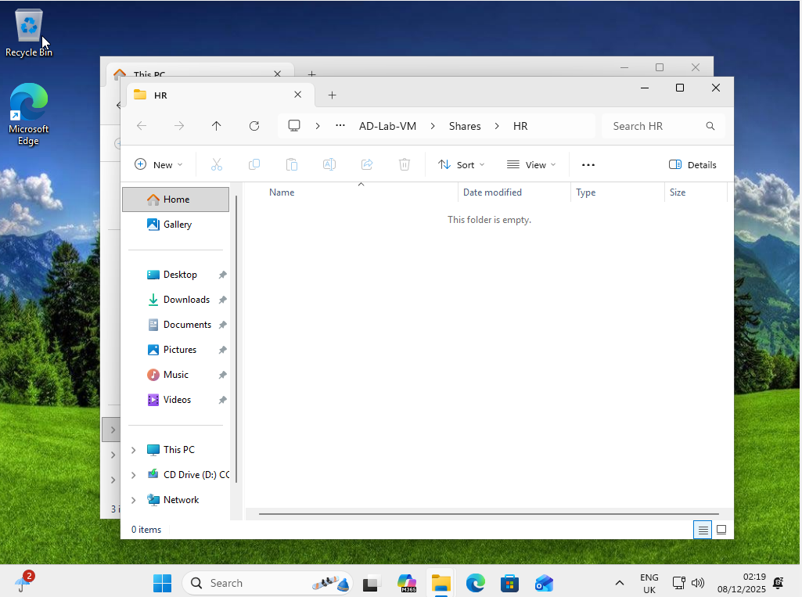  
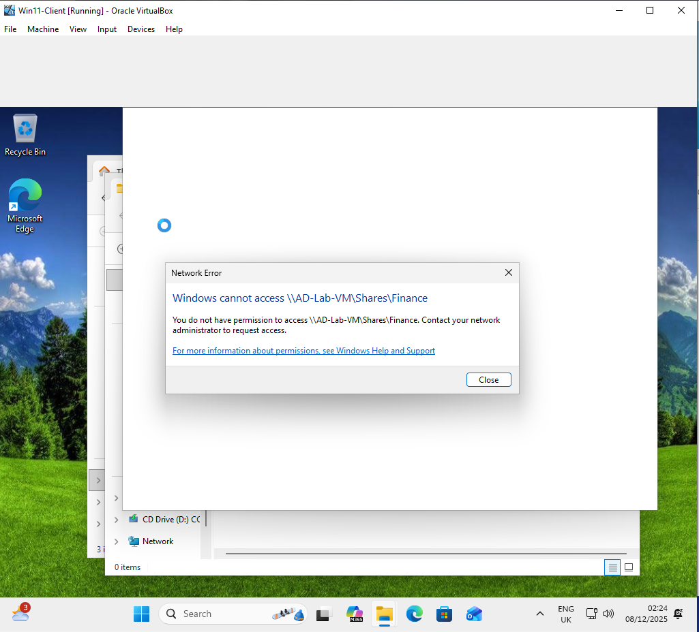

---

# ✅ Scenario 5: Offboarding User

### 📝 Ticket  
“Please disable the account for departing employee: Chloe Adams.”

### 🛠 Resolution Steps  
- Disabled domain account  
- Removed security group memberships  
- Moved to Offboarded OU (optional)  
- Verified user can no longer log in

### 📸 Screenshots  
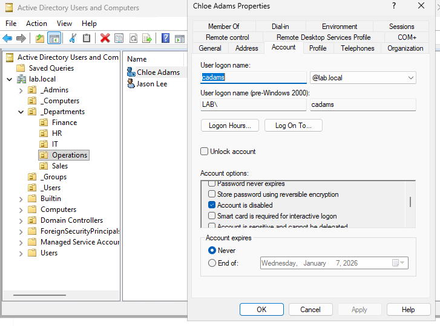  
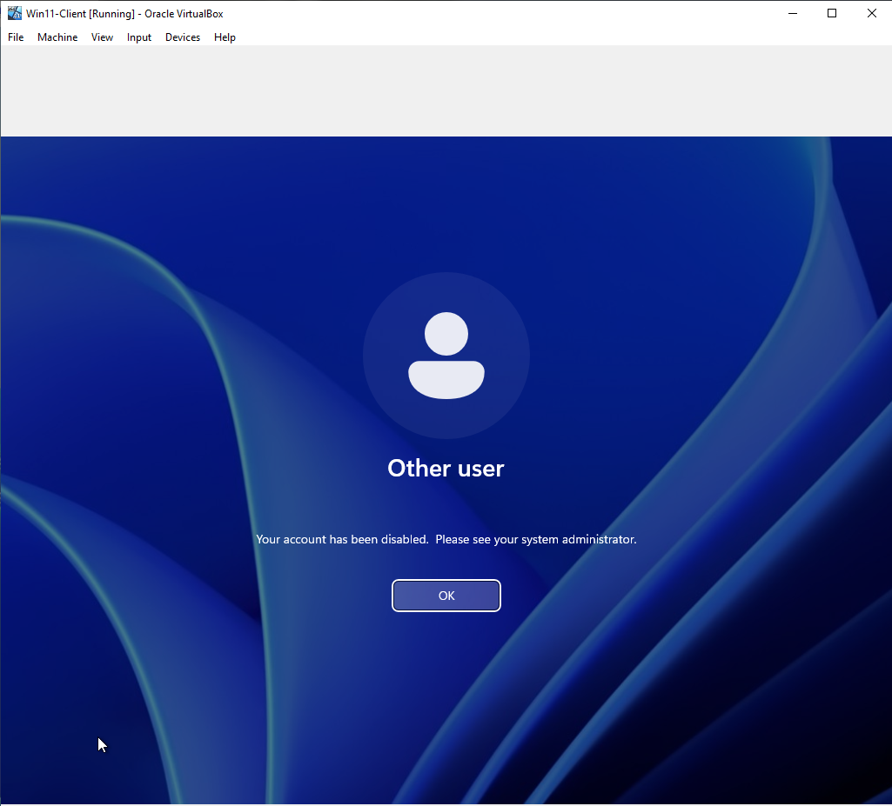

---

# ⭐ Phase Outcome

This phase demonstrates practical, real-world IT support skills including:

- Identity management  
- Password and account recovery  
- Group-based access control  
- Drive mapping troubleshooting  
- User onboarding and offboarding  
- NTFS and GPO validation  
- Department access changes  

These scenarios mirror the daily responsibilities of a Service Desk Technician, Desktop Support Engineer, or Junior Sysadmin inside an enterprise environment.


---
# 📌 Phase 8 – Entra ID Hybrid Identity & Conditional Access (Completed)

Phase 8 extends the on-premises Active Directory environment into Microsoft Entra ID, creating a realistic hybrid identity and Zero Trust access model.

This phase focuses on:
- Hybrid identity
- Device trust
- Conditional Access
- Modern Microsoft MFA requirements

This phase reflects real enterprise identity behaviour rather than simplified lab assumptions. 
---

## 8.1 – Microsoft Entra Tenant Setup

A Microsoft Entra tenant was created to represent the organisation’s cloud identity platform.

The tenant is used to:
- Host synced users and groups
- Register hybrid-joined devices
- Apply Conditional Access policies
- Enforce MFA and security controls

No cloud-only users are used for daily access in this lab.
  
 

---

## 8.2 – Entra Connect Sync (On-Prem to Cloud)

Microsoft Entra Connect Sync was installed on the domain controller.

Configuration highlights:
- Sync type: Entra Connect Sync
- Source directory: On-prem Active Directory
- OU filtering enabled to sync only required objects:
  - Users
  - Groups
  - Computers

After initial synchronisation:
- On-prem users appeared in Entra ID
- Security groups appeared in Entra ID
- The Windows 11 client later appeared as a hybrid-joined device

This confirmed successful directory synchronisation.

📸 Screenshots:
  
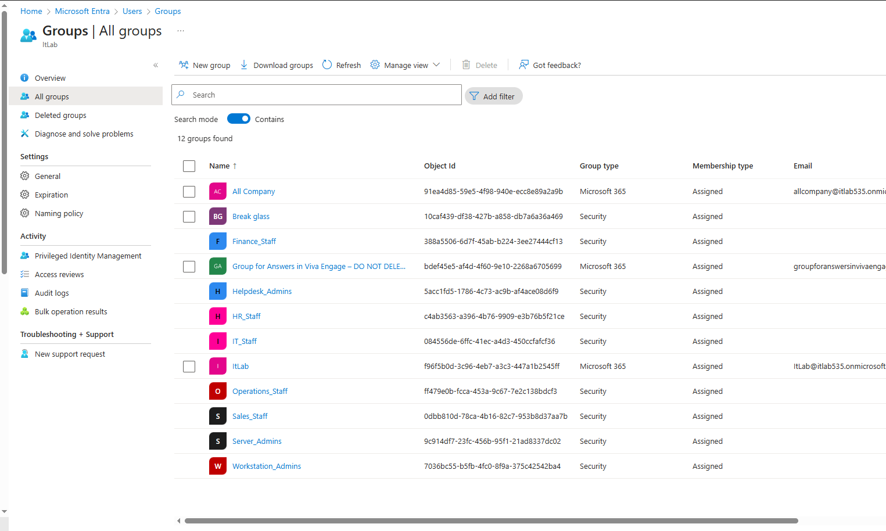
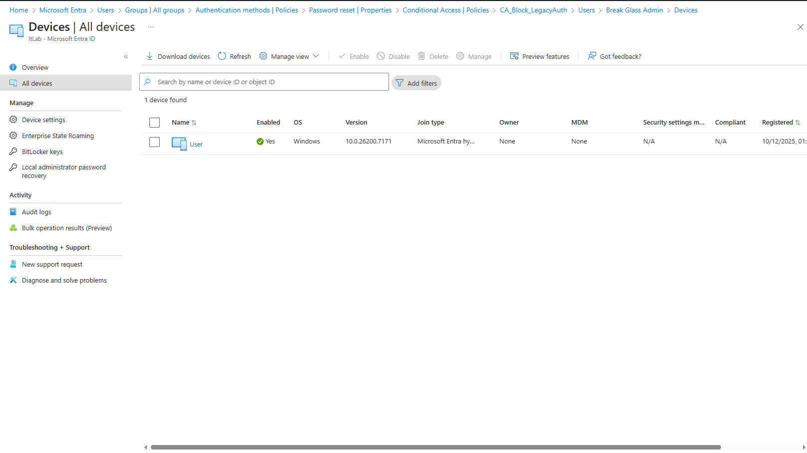


---

## 8.3 – Hybrid Azure AD Join (Windows 11 Client)

The existing Windows 11 client, already domain-joined, was hybrid joined to Entra ID.

Hybrid join behaviour:
- Device remains joined to on-prem Active Directory
- Device is also registered in Entra ID
- Cloud services can trust the device

Verification was performed on the Windows 11 client using:

powershell
dsregcmd /status
Confirmed values:

DomainJoined : YES
AzureAdJoined : YES
AzureAdPrt : YES
CloudTgt : YES

This confirms a healthy hybrid join and valid cloud trust.

📸 Screenshots:

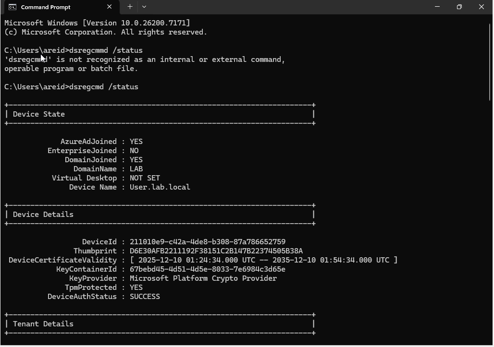
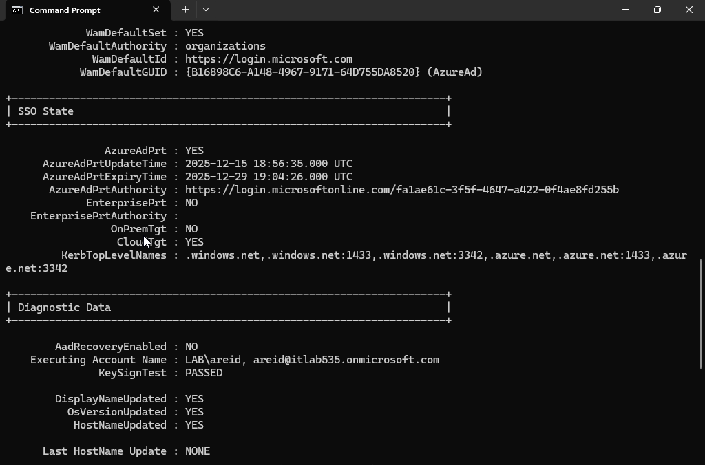
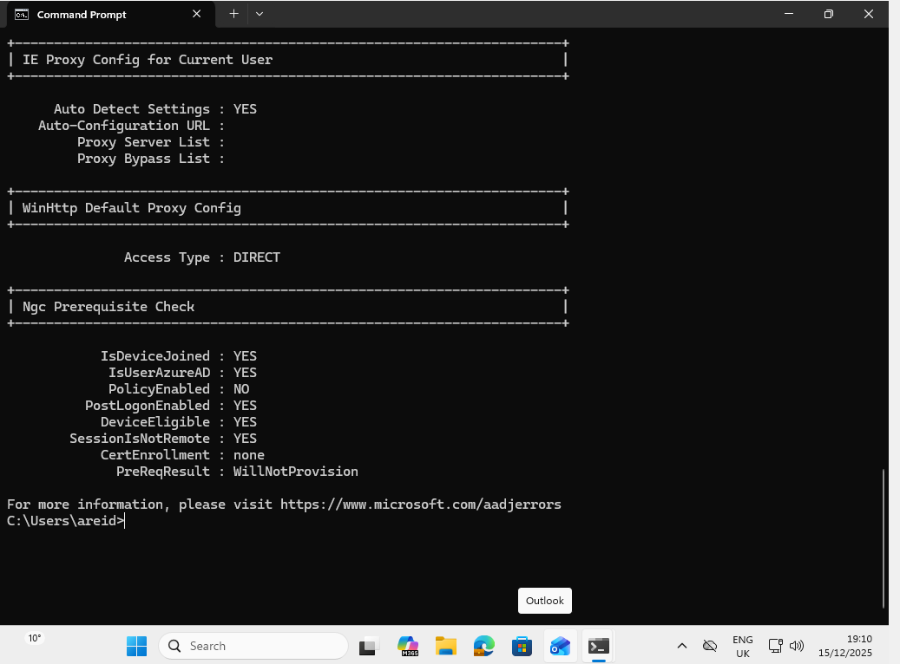


---
## 8.4 – Hybrid Sign-In Behaviour (Expected)

After hybrid join and directory synchronisation, the following sign-in behaviour is observed:

- Signing in with on-prem domain credentials automatically maps to the cloud identity
- Windows uses the Entra ID identity to obtain cloud tokens for Single Sign-On
- Access to Microsoft 365 and other cloud services occurs without reauthentication
- Attempts to force a purely local domain-only sign-in are overridden by design

This behaviour is expected for hybrid-joined devices and confirms correct integration between on-prem Active Directory and Microsoft Entra ID.

---
## 8.5 – Microsoft Mandatory MFA Behaviour

During this phase, modern Microsoft security enforcement behaviour was observed within the Entra ID tenant.

Key observations:
- Password-only cloud identities are no longer permitted
- All cloud users are required to register at least one authentication method
- Privileged and administrative roles are expected to use MFA
- MFA may be enforced by the Microsoft platform even when Conditional Access policies are set to report-only

This lab follows Microsoft’s current security posture and platform-enforced MFA requirements rather than attempting to bypass or weaken them.

---
## 8.6 – Conditional Access Policies

Conditional Access policies were implemented to enforce Zero Trust principles within the hybrid identity environment.

Three policies were created to control access based on user identity, device trust, and authentication method.

---

### 8.6.1 – Require MFA for Users

**Purpose:** Enforce multi-factor authentication for users and administrators.

Configuration:
- Users: All users
- Excluded: Emergency (break-glass) account only
- Cloud apps: All cloud apps
- Grant: Require multi-factor authentication
- Status: Enabled

Result:
- Users are required to complete MFA
- Administrative roles are also required to complete MFA
- Aligns with Microsoft mandatory MFA requirements

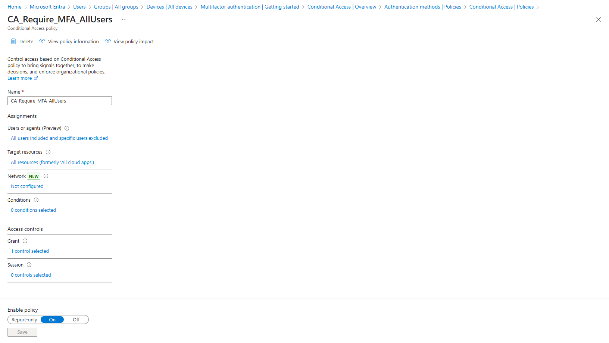

---

### 8.6.2 – Require Hybrid-Joined Devices

**Purpose:** Allow access only from trusted devices.

Configuration:
- Users: All users
- Excluded: Emergency account
- Device platform: Windows
- Grant: Require Hybrid Azure AD joined device
- Status: Enabled

Note:
“Require compliant device” was intentionally not used, as device compliance via Intune is outside the scope of this lab.

Result:
- Hybrid-joined Windows 11 client is allowed access
- Non-joined or untrusted devices are blocked
- Initial blocking demonstrated real-world Conditional Access troubleshooting

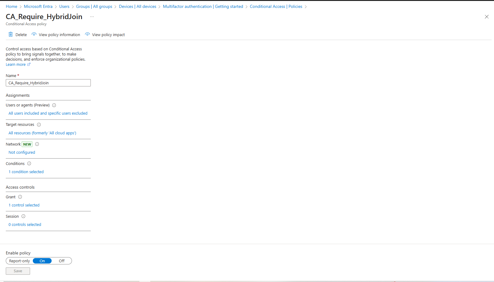

---

### 8.6.3 – Block Legacy Authentication

**Purpose:** Prevent insecure legacy authentication methods.

Configuration:
- Users: All users
- Excluded: Emergency account
- Client apps: Legacy authentication clients only
- Grant: Block access
- Status: Enabled

Result:
- Legacy authentication protocols are blocked
- Modern authentication remains unaffected


---
## 8.7 – Emergency (Break-Glass) Account

An emergency access (break-glass) account was configured to ensure tenant recovery in the event of misconfiguration or Conditional Access lockout.

Characteristics:
- No administrative roles assigned
- Excluded from all Conditional Access policies
- MFA exclusion allowed only for emergency access scenarios
- Not used for day-to-day administration or normal sign-ins

This setup mirrors Microsoft best practice for identity recovery while maintaining a secure Zero Trust posture.

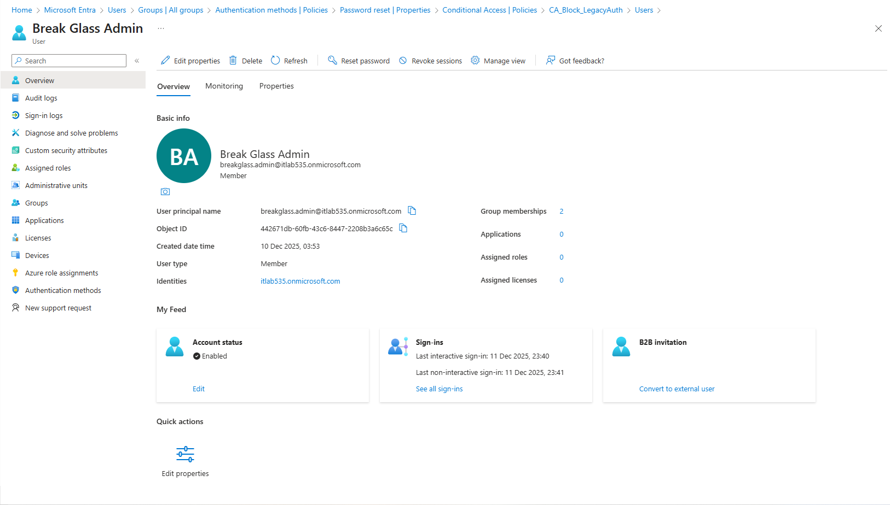

---
## 8.8 – Validation and Testing

Validation was performed to confirm correct hybrid identity behaviour and Conditional Access enforcement.

Test 1 – Hybrid-Joined Device Access  
- Sign-in from the hybrid-joined Windows 11 client  
- MFA challenge presented  
- Access successfully granted  

Test 2 – Untrusted Device Access  
- Sign-in attempt from a non-joined device  
- Access blocked by Conditional Access  

Test 3 – Legacy Authentication  
- Legacy authentication attempts blocked  
- Modern authentication methods remain unaffected  

Test 4 – Admin MFA Enforcement  
- Privileged role sign-ins require MFA  
- Enforcement applied through Conditional Access and Microsoft platform rules  

These tests confirm correct policy application and realistic enterprise security behaviour.


# 🧑‍💻 Author  
**Mohammad Masood (mullvad25)**  
Aspiring IT Support & Systems Engineer  
Focused on infrastructure, cloud, networking, and enterprise IT tools.

---

# 🌐 Purpose of This Lab  
This project is meant to:

- Build real job-ready IT skills  
- Strengthen a professional portfolio  
- Prove hands-on technical ability to recruiters  
- Prepare for IT Support, Help Desk, Desktop Support, and Sysadmin roles  

---

